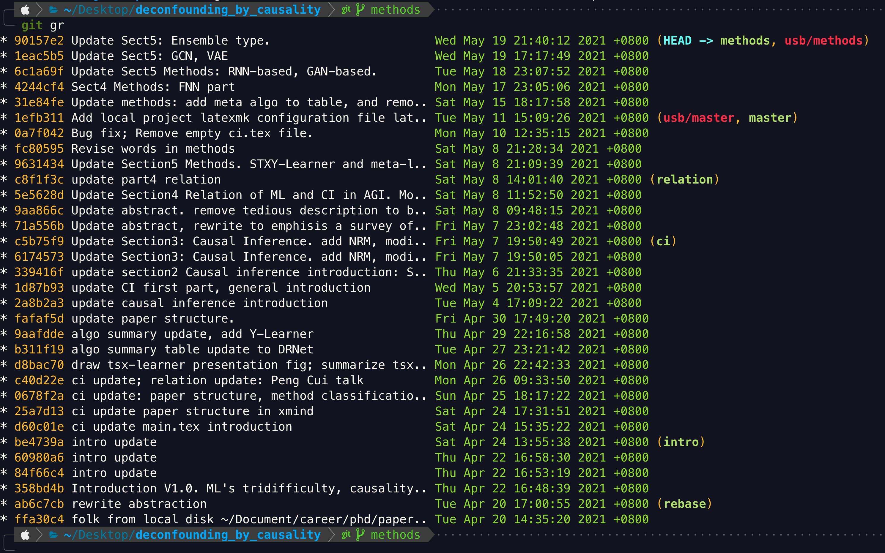
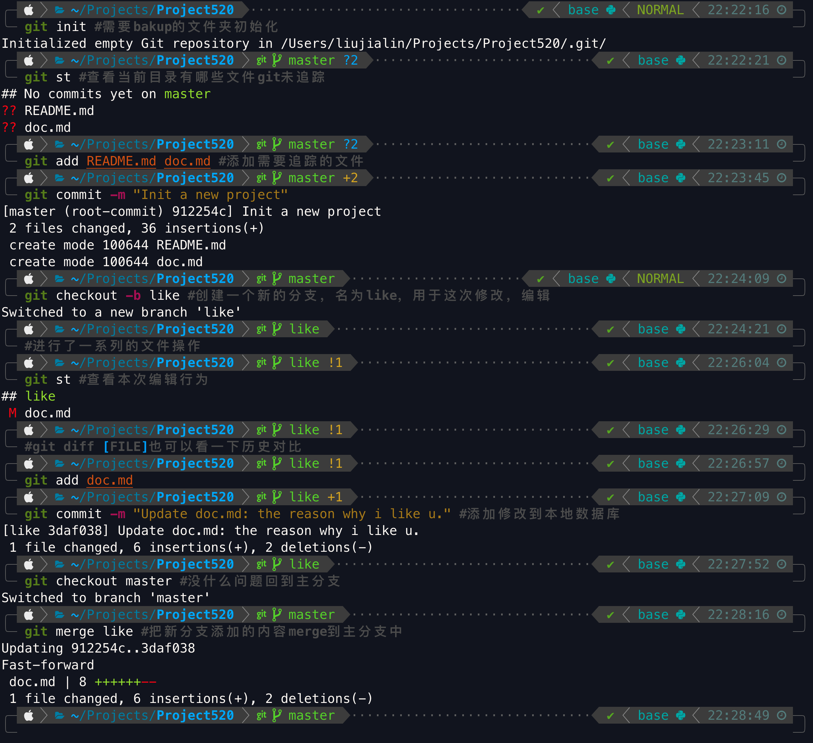
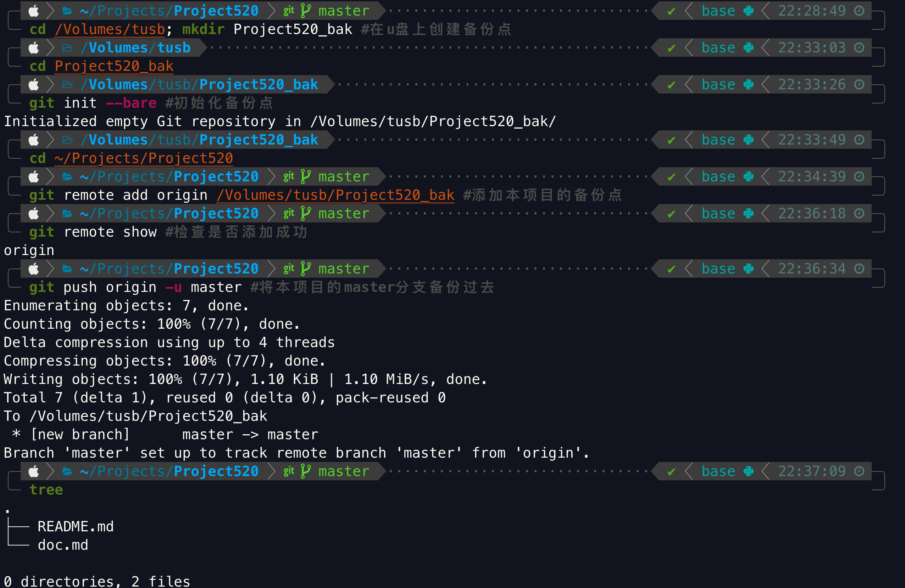

# 文件备份方案：git
git本身是分布式代码版本管理工具，最近在写论文的时候，尝试
用git管理论文草稿的备份，发现非常好用。

## 优点
* 增量更新：只备份更新的部分。
* 更新历史回溯：who于when在which文件中添加了what。

* 操作撤销：当前编辑可以撤销，甚至撤回历史状态中。
* 多人协作管理：不同分支同步编写，最后merge到最终项目中。

## 命令
```bash
git init --bare # 设置备份盘
git add # 将文件添加到git追踪中
git commit # 将追踪文件添加到本地数据库，并打上一个timestamp
git restore # 撤销历史版本的各种修改问题
git checkout # 切换分支，新建分支
git merge # 融合分支的工作到主分支中
git remote add # 添加远程备份点
git push # 将本次修改添加到远程备份点
```

## 案例

* 本地编辑管理操作

* 备份点设置

